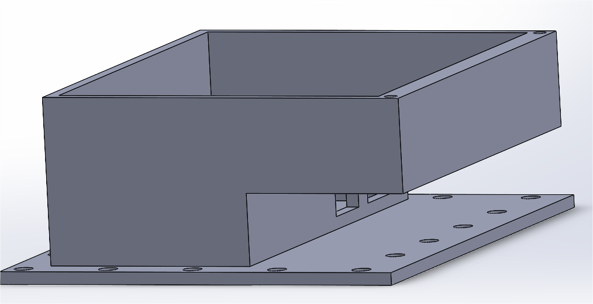
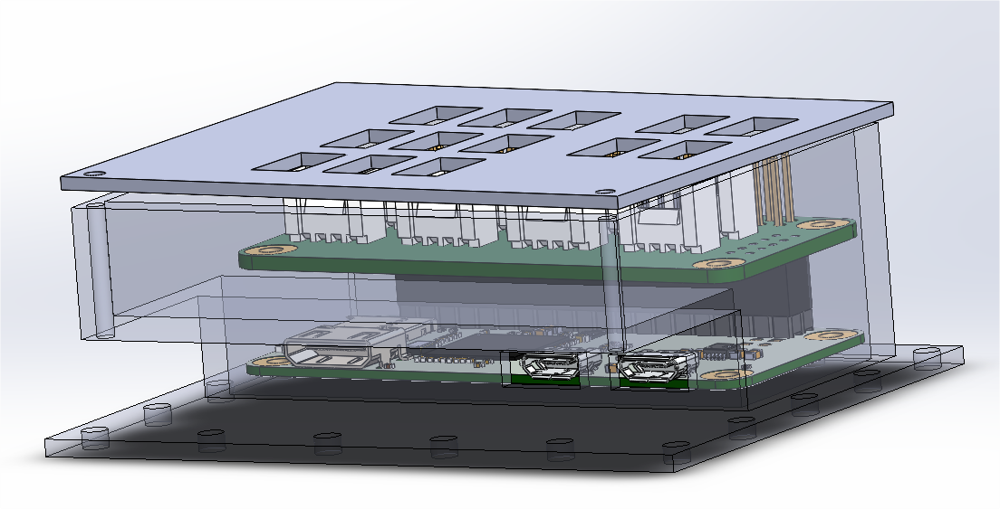

# Projet OCS - Groupe 3

- ##### *Munier Rémy*
- ##### *Bond Adam*
- ##### *Ala Younes*

## Sac à dos connecté

## Description

### Features

**Deux familles de features:**

1. Les aides à la route et features ergonomiques

Le sac détecte les conditions de lumière basse et allume des lumières internes quand le sac est ouvert pour aider l'utilisateur à trouver ses affaires. Une lumière externe permet aussi à l'utilisateur de s'orienter en cas d'urgence, activable grâce à un bouton.

Un accéléromètre est présent sur le sac et permet aux feux de freins (LEDs sur le dos du sac) de s'allumer automatiquement quand le cycliste baisse brusquement de vitesse. Le capteur sert aussi à détecter un choc, dans ce cas une notification est envoyée à l'utilisateur, si il le réponds pas, une alerte d'urgence peut être envoyées a des (mails/numéro de tel/utilisateurs ?) enregistrés dans l'appli, de plus les LEDs du sac clignotent pour émettre un SOS lumineux.

Un capteur de distance est présent à l'arrière pour indiquer à l'utilisateur quand un véhicule le suit de trop près. Cette alerte ne se fait pas à l'arrêt mais uniquement pendant le déplacement (détecté grâce à l'accéléromètre).

2. Le relais au téléphone

Le sac sert de relais au téléphone portable du cycliste en lui permettant de se tenir au courant de ses notifications (appels, messages, etc) de manière sûre avec des vibrations sur chaque épaulière. Le relais va dans les deux sens puisque le sac à dos dispose d'un système de cordons sur lequel l'utilisateur peut tirer pour indiquer une décision.

La hiérarchisation entre notifications a pour but de permettre à l'utilisateur de savoir quel type de notification l'attend en fonction des caractéristiques (force, temps, répétition) de la vibration et de prendre une décision (arrêt ou non) en fonction. Si deux notifications ont lieu en même temps, cela permet aussi de savoir laquelle doit prendre la priorité quand on informe l'utilisateur (Appels > Messages > Misc).

Ici nous envisageons aussi à terme de rendre une API libre pour programmer les lumières et les cordons, ce qui permettrait à d'autres utilisateurs de créer des utilisations correspondant à d'autres coeurs de métiers.

3. Un scénario d'utilisation se servant des deux types de features:

L'utilisateur choisit un parcours sur son téléphone. A chaque fois qu'il arrive à une intersection, les vibrations sur l'épaulière lui indiqueront la direction dans laquelle il veut tourner. Les épaulières vibrent différamment pour indiquer une notification. Le cycliste s'arrête pour lire son message, décide de faire un détours en conséquence, et tire sur un cordon pour allumer la lumière correspondante à l'arrière car il veut prendre une direction contraire à celle indiquée par son GPS.

### Architecture and Flowcharts

|   Global Architecture       |
|-----------------------------|
||

| General Flowchart      | Ergonomic Flowchart      |
|------------|-------------|
|||

### Services 
  
## Matériel

### Capteurs

- Capteur de distance à l'arrière
- Accéléromètre pour les feux de frein et la détection de choc
- Capteur de luminosité
- Capteur de force/pression pour le système de cordes

### Actionneurs

- LEDs
- Vibrations

### Matériel choisi

Au niveau du matériel, le défi dans ce projet est d'équilibrer les contraintes:

1. De poids, car l'utilisateur risque de porter le sac toute la journée;
2. D'autonomie, la batterie devant être suffisamment conséquente pour tenir au moins une journée avec charge complête, sans non plus être trop lourde;
3. D'ergonomie, étant donné qu'il faut trouver comment caser les composants dans le sac sans gêner l'utilisateur, donc avec une place limitée, tout en respectant les deux premières contraintes.

Nous nous sommes orientés vers une Raspberry Pi Zero car sa petite taille et sa consommation basse sont des avantages conséquents et les capteurs que nous utilisons ne nécessitent pas de puissance de calcul démesurée (pas de caméra par exemple).

En revanche, nous anvons choisi le module Grove Base Hat au lieu du Grove Base Hat Zero (conçu spécialement pour la Zero) à cause du nombre insuffisant d'entrées digitales dans le second (seulement 2).

| Nom Produit                                                                                                                    | Nombre | I/O                                                               |
| ------------------------------------------------------------------------------------------------------------------------------ | ------ | ----------------------------------------------------------------- |
|                                                                                                                                |        |                                                                   |
| [Stick 10 LEDs RGB Grove 104020131](https://www.gotronic.fr/art-stick-10-leds-rgb-grove-104020131-29077.htm)                 | 2      | 2 Digital                                                         |
| [Led 8 mm RGB Grove V2.0 104020048](https://www.gotronic.fr/art-led-8-mm-rgb-grove-v2-0-104020048-27067.htm)                 | 8      | 1 Digital (puis en cascade)                    |
| [Module vibreur Grove 105020003](https://www.gotronic.fr/art-moteur-haptique-vibreur-grove-105020011-24538.htm)              | 2      | 2 I2C                                                             |
| [Accéléromètre 3 axes Grove 101020054](https://www.gotronic.fr/art-accelerometre-3-axes-grove-101020054-18957.htm)           | 1      | 1 I2C                                                             |
| [Télémètre à ultrasons Grove 101020010](https://www.gotronic.fr/art-telemetre-a-ultrasons-grove-101020010-18976.htm)         | 1      | 1 Analog                                                          |
| [Batterie externe USB V206](https://www.gotronic.fr/art-batterie-externe-usb-v206-28874.htm)                                 | 1      |                                                                   |
| [Module touche sensitive Grove 101020037](https://www.gotronic.fr/art-module-touche-sensitive-grove-101020037-19049.htm)     | 2      | 2 Digital                                                         |
| [Détecteur de lumière Grove V1.2 101020132](https://www.gotronic.fr/art-detecteur-de-lumiere-grove-v1-2-101020132-25427.htm) | 1      | 1 Analog                                                          |
| [Module Grove Base Hat 103030275](https://www.gotronic.fr/art-module-grove-base-hat-103030275-28937.htm)                     | 1      |                                                                   |
| [Carte Raspberry Pi Zero WH](https://www.gotronic.fr/art-carte-raspberry-pi-zero-wh-27670.htm)                               | 1      | 1 X micro SD, 1 X mini HDMI, 1 X micro USB OTG, 1 X CSI, 1 X GPIO |

#### Total I/O

**Disponible**
4 Analog, 6 Digital, 1 PWM, 3 I2C, 1 UART

**Utilisé**
1 Analog, 3 ou 4 Digital selon les LEDs, 3 I2C

#### Matériel reçu

- Raspberry Pi Zero x3
- Grove Base Zero x3
- Carte Micro SD 8GB x3
- Chargeur Micro USB x3

### Objet physique
Première ébauches 3D de l'objet physique qui viendra se coudre dans le sac, basé sur une pi 0 et un grove base hat :

Nous n'avons pas trouvé de model 3D du Grove base hat, et nous sommes donc basé sur le Grove base hat Zero, qui posède les mêmes dimensions mis à part la profondeur qui a étée prise en compte :

Il nous reste à faire un couvercle permettant de laisser passer les connecteurs Grove ainsi que les trous au niveau de ports usb de la raspberry afin de faire passer le cable d'alimentation.

